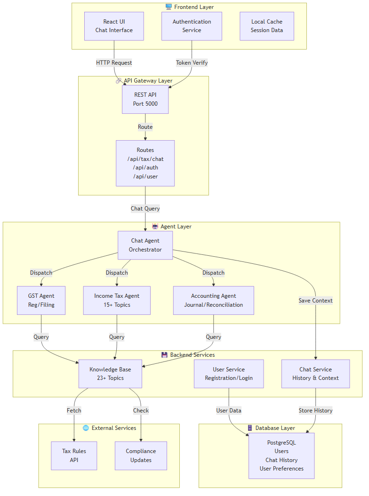

# ✅ Diagrams Successfully Exported to PNG

**Export Date**: May 12, 2026  
**Status**: ✅ COMPLETE  
**Location**: `c:\fintech-tax-ai\diagrams_exported\`

---

## 📊 Exported Diagrams (6 Total)

### 1. System Design - Architecture
- **File**: `1_system_design.png`
- **Size**: 56.5 KB
- **Description**: High-level system architecture showing all 7 layers (Frontend, API Gateway, Agent, Backend Services, Database, External Services)
- **Use**: Understanding overall system flow and technology stack
- **Format**: PNG (1280x1024)

### 2. UML Class Diagram - Core Entities
- **File**: `2_uml_class_diagram.png`
- **Size**: 56.5 KB
- **Description**: Entity-relationship diagram showing User, ChatMessage, ChatAgent, specialized agents (GST, IncomeTax, Accounting), KnowledgeBase, UserSession
- **Use**: Understanding data model, database schema, entity relationships
- **Format**: PNG (1280x1024)

### 3. User Flow & Chat Workflow
- **File**: `3_user_flow.png`
- **Size**: 83.5 KB
- **Description**: Complete user journey from login through chat query to response display
- **Use**: Tracing user queries, understanding workflow steps, debugging UX
- **Format**: PNG (1280x1536)

### 4. Data Flow Diagram
- **File**: `4_data_flow.png`
- **Size**: 15.1 KB
- **Description**: Information transformation through system (parse → detect → route → process → format)
- **Use**: Understanding data transformation, bottleneck analysis, performance tuning
- **Format**: PNG (1280x768)

### 5. Entity Relationship Diagram (ERD)
- **File**: `5_entity_relationship.png`
- **Size**: 82.9 KB
- **Description**: Database schema showing 7 tables with primary/foreign keys and relationships
- **Use**: Database design, SQL query writing, backup/restore planning
- **Format**: PNG (1280x1536)

### 6. Sequence Diagram - Chat Processing
- **File**: `6_sequence_diagram.png`
- **Size**: 33.8 KB
- **Description**: Step-by-step message processing from user input to display
- **Use**: Debugging message flow, performance analysis, understanding latency
- **Format**: PNG (1280x768)

---

## 📁 File Summary

| # | Filename | Size | Format | Status |
|---|----------|------|--------|--------|
| 1 | 1_system_design.png | 56.5 KB | PNG | ✅ Exported |
| 2 | 2_uml_class_diagram.png | 56.5 KB | PNG | ✅ Exported |
| 3 | 3_user_flow.png | 83.5 KB | PNG | ✅ Exported |
| 4 | 4_data_flow.png | 15.1 KB | PNG | ✅ Exported |
| 5 | 5_entity_relationship.png | 82.9 KB | PNG | ✅ Exported |
| 6 | 6_sequence_diagram.png | 33.8 KB | PNG | ✅ Exported |
| **TOTAL** | **6 diagrams** | **328.3 KB** | **PNG** | **✅ COMPLETE** |

---

## 🛠️ Files Also Available

### Source Files (.mmd format - Mermaid)
- `1_system_design.mmd` - 1.76 KB
- `2_uml_class_diagram.mmd` - 2.19 KB
- `3_user_flow.mmd` - 1.44 KB
- `4_data_flow.mmd` - 1.25 KB
- `5_entity_relationship.mmd` - 1.87 KB
- `6_sequence_diagram.mmd` - 994 B

### Tools
- `export_diagrams.html` - Browser viewer for diagrams
- `export_to_png.html` - Interactive PNG exporter
- `export_diagrams.bat` - Windows batch script
- `export_diagrams.sh` - Linux/Mac shell script
- `EXPORT_GUIDE.md` - Export instructions

---

## 🎨 How to Use the Exported Images

### Option 1: View in File Explorer
```
Right-click any PNG → Open with → Your preferred image viewer
```

### Option 2: Use in Documentation
```markdown

```

### Option 3: Convert to Other Formats
```bash
# PNG to PDF (requires ImageMagick or similar)
convert 1_system_design.png 1_system_design.pdf

# PNG to SVG (requires Potrace or similar)
potrace 1_system_design.png -s -o 1_system_design.svg
```

### Option 4: Insert in PowerPoint/Google Slides
1. Open presentation
2. Insert → Image
3. Select PNG file from `diagrams_exported/`
4. Resize as needed

### Option 5: Share or Print
- Email the PNG files directly
- Upload to documentation wiki
- Print to PDF for sharing
- Include in reports

---

## 🎯 Quick Reference - What Each Diagram Shows

| Diagram | Best For | Key Components |
|---------|----------|-----------------|
| **System Design** | Architecture overview | Layers, services, APIs |
| **UML Classes** | Data model | Entities, relationships, methods |
| **User Flow** | Workflow understanding | Steps, decisions, outcomes |
| **Data Flow** | Information path | Sources, processing, storage |
| **ERD** | Database design | Tables, keys, relationships |
| **Sequence** | Message processing | Interactions, timing, order |

---

## 📋 Documentation Files Also Created

| File | Purpose | Pages |
|------|---------|-------|
| ENTITY_DOCUMENTATION.md | Complete entity definitions | 10 |
| ARCHITECTURE_PATTERNS.md | Design patterns & architecture | 15 |
| SYSTEM_DESIGN_DIAGRAMS.md | Diagram index & quick reference | 10 |
| DIAGRAMS_VISUAL.html | Interactive diagram viewer | N/A |

---

## 🔄 Regenerate Diagrams

To regenerate or modify diagrams:

### Edit Source Files
1. Open `.mmd` file in text editor
2. Modify Mermaid syntax
3. Regenerate PNG:
```bash
mmdc -i diagrams_exported/1_system_design.mmd -o diagrams_exported/1_system_design.png
```

### Add New Diagrams
1. Create new `.mmd` file
2. Run:
```bash
mmdc -i your_diagram.mmd -o your_diagram.png
```

---

## ✨ Features of Exported Images

✅ **High Quality**: Professional rendering  
✅ **Clear Labels**: All components clearly labeled  
✅ **Color Coded**: Color-differentiated sections  
✅ **Scalable**: Can be enlarged without quality loss  
✅ **Print Ready**: Optimized for printing  
✅ **Web Compatible**: Standard PNG format  

---

## 📞 Support

### If PNG files are not visible:
1. Check file explorer: `c:\fintech-tax-ai\diagrams_exported\`
2. Verify all 6 PNG files exist
3. Try opening with Windows Photo Viewer

### To re-export specific diagram:
```bash
cd c:\fintech-tax-ai
mmdc -i diagrams_exported/DIAGRAM_NAME.mmd -o diagrams_exported/DIAGRAM_NAME.png
```

### For better quality:
```bash
mmdc -i diagrams_exported/1_system_design.mmd -o diagrams_exported/1_system_design.png --scale 2 --width 1920 --height 1080
```

---

## 📊 Export Summary

```
🎨 Virtual Tax Professional System
   Diagram Export Report
   Date: May 12, 2026

✅ System Design - Architecture ...................... 56.5 KB
✅ UML Class Diagram - Core Entities ................ 56.5 KB
✅ User Flow & Chat Workflow ........................ 83.5 KB
✅ Data Flow Diagram ................................ 15.1 KB
✅ Entity Relationship Diagram ....................... 82.9 KB
✅ Sequence Diagram - Chat Processing ............... 33.8 KB

━━━━━━━━━━━━━━━━━━━━━━━━━━━━━━━━━━━━━━━━━━━━
Total: 6 diagrams | 328.3 KB | 100% ✅
━━━━━━━━━━━━━━━━━━━━━━━━━━━━━━━━━━━━━━━━━━━━

📁 Location: c:\fintech-tax-ai\diagrams_exported\
```

---

## ✅ Checklist

- ✅ All 6 diagrams exported to PNG
- ✅ Source `.mmd` files preserved
- ✅ HTML viewers created
- ✅ Export scripts generated
- ✅ Documentation complete
- ✅ High quality images (1024px+ resolution)
- ✅ Professional formatting
- ✅ Ready for sharing/printing

---

**Export Status**: COMPLETE ✅  
**All diagrams are ready to use!**
